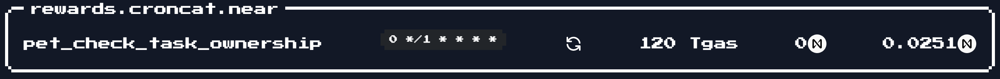

# Tutorial: Pixel Pets

Learn how to use croncat by earning a special (and powerful) pixel pet! This tutorial covers the process of creating and watching a croncat task from start to finish. It is intended to show you the process through step by step examples. The solution to this challenge will award you with a 1 of a kind pixelpet! Note: the solution is not fully documented here, you will need to take notes along the way to create the final cli command.

## The Challenge

To get rewarded the croncat pixel pet, you must have courage, adventurous mindset & a little command line skill. If you follow this tutorial and take a few notes, you should easily be able to figure out the answer and earn a powerful croncat pet!


#### Overview

* Learn what a croncat task is
* Learn how to encode CLI parameters
* Learn how to automate using croncat
* Get the croncat pixel pet
* Share on social!

## Prerequisites

To create and interact with this tutorial, please make sure you have installed the NEAR CLI.

1. [Click here to install Near CLI -->](https://www.npmjs.com/package/near-cli)
2. Login with Near CLI (you will need to be logged in to sign transactions)
3. Sign in to [pixelpets](https://ecosystem.pixeldapps.co/pixelpets) at least once (so you know you have an account)

## Clue 1: Anatomy of a Cron Task

Before you create a task with croncat, its important to understand the configuration of a task. 
Tasks consist of several parameters that specify where, what & when a task should execute. Starting at the simplest level, let's look at each parameter:

* **contract_id**: The contract id is the near account where some code exists. This is the account that holds all the logic and functionality for making things like NFT transfers happen.
* **function_id**: The name of the function to execute, similar to saying the specific piece of logic within a contract. Sometimes referred to as the method name.
* **cadence**: The most important part of a task is the timing, when some code should be executed. The cadence uses the crontab standard, which is a simple way to specify a time without lots of special handling for natural time and UTC. It can simply be a short string where each character represents a minute, hour, day, month or year. You can [read more about the specification here](https://crontab.guru/). 
* **recurring**: A recurring task will follow the cadence timing and schedule a task to execute until there are no funds left. This allows a function to get called as many times as needed or can be executed only once in the future. 
* **deposit**: Sometimes a function needs a balance payed, this deposit will be sent on each task execution - so be mindful to give the task enough balance when you create it!
* **gas**: This is the gas amount needed for 1 function call. It's the same gas amount needed if you were just executing the transaction one time. Be careful to specify gas that allows for larger logic variables or there wont be enough gas to complete the function call!
* **arguments**: The arguments are base64 encoded JSON that get passed into the function. This allows specific variables to get used in addition to just triggering a function. Note: Croncat cannot change the variables, and neither can the agents. The arguments used in this function call are sandboxed away from any changes, so if you need dynamic arguments make sure to do so within your contract.

An example of a cron task occurring every 5 minutes would look something like this:

```json
{
  "contract_id": "counter.testnet",
  "function_id": "increment",
  "cadence": "0 */5 * * * *",
  "recurring": true,
  "deposit": "0",
  "gas": 180000000000000,
  "arguments": ""
}
```

Now that you have some idea of what data is needed for a cron task, time to look at a few pieces for claiming the croncat pet!

## Clue 2: Task Parameters & Encoding

Time for a little secret sauce ;)

You may be used to seeing near-cli commands that looks something like this:

```bash
near call counter.near increment '{"add": 3}' --accountId cool_tutorials.near --amount 0.1
```

This is how you can call any contract on the blockchain and execute some code. But what if we wanted to call a contract that called another contract on the blockchain with some arguments?
That is not as straight forward. In fact, if we simply followed the same path above, the contract would receive raw data that it didnt know how to decode.

For this challenge to work, we need to know how to encode arguments that croncat can use when calling other contracts. 

There are a few great sites out there [like this one that convert data into a Base64 string](https://www.base64encode.org/). Once encoded, the result ends up looking something like this: `eyJ0YXNrX2hhc2...`

Try encoding `{"type_of_variable": "string"}`. You should get something like the following:

```bash
eyJ0eXBlX29mX3ZhcmlhYmxlIjogInN0cmluZyJ9
```

Did you match this output? If so, time for the final clue!


## Clue 3: Creating A Croncat Task


Okay, let's construct the pieces of a croncat task, and focus only on what is needed to create a pixelpet.

First off, you need to know what contract and function will be getting called. In this case, we will be creating a task that calls the croncat rewards contract that has a special function to distribute croncat pets!

```bash
"contract_id": "rewards.croncat.near",
"function_id": "pet_check_task_ownership",
```

Next we need to setup a cadence for this task to get executed. Above you can see an example of every 5 minutes. In this case you can execute up to every 1 minute and it will be fine.

We also need to consider `recurring`, in this case we need the function to get called two times (One time to check if the task was created, another time to clear the task). This also means the task needs enough fees to cover executing 2 times. More on that in a second.

Deposit can simply stay `"0"` as we don't need to pay anything to the rewards contract.

Gas is suggested to be `180000000000000` to make sure no issues running out.

Lastly the most important piece: `arguments`

### Arguments

In clue 2 we looked at how to encode data that a contract can use when calling another contract. The rewards contract will get called by the croncat manager contract, so we need to encode arguments needed for the task to succeed.

There are 2 things we need to do:
1. Get the task_hash to let rewards know which task was created by you
2. Encode the task_hash so croncat manager can pass the argument data correctly

For #1, you will need to use the Near CLI to get the task_hash for your cron task. You can use the following, but you need to change it to the owner account you will be using in pixelpets.

```bash
NEAR_ENV=mainnet near view manager_v1.croncat.near get_hash '{"owner_id": "YOUR_ACCOUNT.near", "contract_id": "rewards.croncat.near", "function_id": "pet_check_task_ownership", "cadence": "0 */1 * * * *"}'
```

For #2, you can take the hash you got above and encode the following payload. Keep track of the encoded string, as it will be used in the task creation arguments!

```bash
{"task_hash":"qX7L5ULjERQ0G7G3mWWxoFyApsi6gYvbT1ws5oGFAKE="}
```

Once you have the encoded arguments, its time to piece the entire command together! Here's an example of what that will look like (yours will differ as each account will create different data)

```bash
NEAR_ENV=mainnet near call manager_v1.croncat.near create_task '{"contract_id": "rewards.croncat.near","function_id": "PET_FUNCTION_ID","cadence": "YOUR_CADENCE","recurring": true,"deposit": "0","gas": 180000000000000, "arguments": "ey_YOUR_ENCODED_ARGUMENTS_"}' --accountId YOUR_ACCOUNT.near --amount 0.0252 --gas 300000000000000
```

### PHEW!
Now you're ready to put all these variables together into a single CLI command. If all goes well, you will receive a link to your transaction on the blockchain!



You can even [check that your task is scheduled here -->](https://cron.cat/tasks)

## Success?!

Congratulations!! If you made it this far, go ahead and refresh the pixelpets game, you will see croncat pet in your main menu. 

## Share & Promote

If you liked this tutorial, please share it with your friends! Here's a quick snippet to share on socials:

```
I just got a special @croncats @PixelDapps #pixelpet using an automated #croncat #task! This pet is dope! 
Can you beat the #NEARvember @nearprotocol #challenge? LFG!
https://docs.cron.cat/docs/tutorials-pixel-pet/
```

Thank you! Be sure to jump in our discord for more awesome croncat things!
